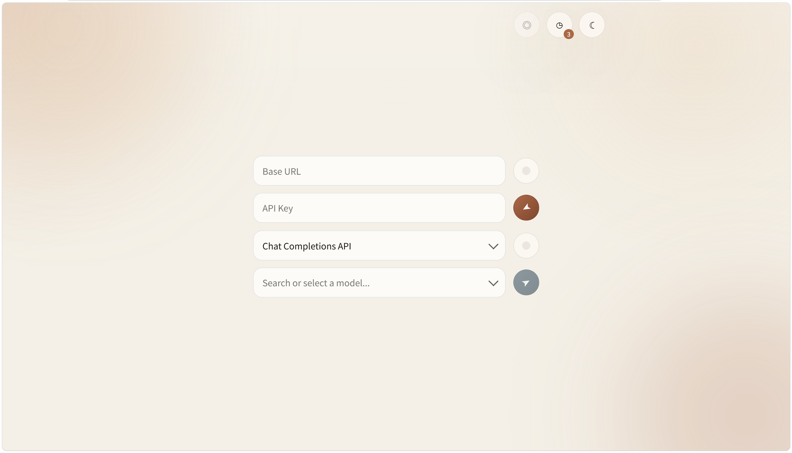

# LLM Ping

## 介绍

LLM Ping 是一个部署在 Cloudflare Workers 上的轻量探测工具，用来快速验证 OpenAI 或 OpenAI-compatible 服务是否可用。它同时提供单页前端和 Worker API，用于加载模型、发起最小调用和批量探测模型可用性。

## 示例



## 核心能力

- 请求上游 `/v1/models` 并加载模型列表
- 支持 `Responses API` 和 `Chat Completions API`
- 支持单模型调用和最多 10 个模型的批量探测
- 提供历史记录、原始响应查看和单文件 HTML 构建

## 快速开始

```bash
npm install
npm run dev
```

生成单文件 HTML：

```bash
npm run build:html
```

## 开发和测试

| 命令 | 说明 |
| --- | --- |
| `npm run dev` | 启动本地 Worker 开发环境 |
| `npm run build` | 生成前端资源到 `public/` |
| `npm run build:html` | 生成 `public/llm-ping.html` |
| `npm run types` | 生成或更新 Worker 类型 |
| `npm run check` | 执行类型检查 |
| `npm test` | 运行 Vitest 测试 |
| `npm run deploy` | 手动部署 Worker |

## 配置

- 当前没有必填环境变量
- Worker 配置文件为 `wrangler.jsonc`
- 主要运行时输入为 `apiKey`、`baseUrl`、`apiMode`、`model` 或 `modelIds`、`messages`
- Worker 代理模式只接受 `https://` 上游地址
- 本地单文件 HTML 模式可直接从浏览器请求上游服务，需要上游支持 CORS

## HTTP API

- `GET /health`
- `POST /api/models`
- `POST /api/invoke`
- `POST /api/probe-models`

示例：

```bash
curl -X POST http://127.0.0.1:8787/api/invoke \
  -H "Content-Type: application/json" \
  -d '{
    "apiKey": "sk-xxx",
    "baseUrl": "https://api.openai.com",
    "apiMode": "responses",
    "model": "gpt-4.1-mini",
    "messages": [
      { "role": "user", "content": "hi" }
    ]
  }'
```

## 项目结构

- `src/worker.ts`：Worker 入口
- `src/routes/`：HTTP 路由
- `src/core/`：校验、限流、上游适配和错误处理
- `src/web/`：前端源码
- `scripts/`：构建脚本
- `public/`：构建产物
- `test/`：测试

## 部署

推荐两种方式：

1. 自动部署
   在 Cloudflare Dashboard 中创建或确认目标 Worker，绑定自定义域名，然后启用 Workers Builds 并连接 GitHub 仓库。之后推送到生产分支即可自动构建和发布。

2. 手动部署
   在本地完成依赖安装和登录 Cloudflare 后，直接运行：

```bash
npm run deploy
```

## 安全和限制

- 会拦截 `localhost`、回环地址、私网地址以及 `.local`、`.internal` 域名
- 当前限流为单实例内存级限流，每个来源 IP 每分钟最多 20 次请求
- `apiKey` 不会在服务端持久化保存
- `POST /api/probe-models` 单次最多允许 10 个 `modelIds`

## License

`ISC`
